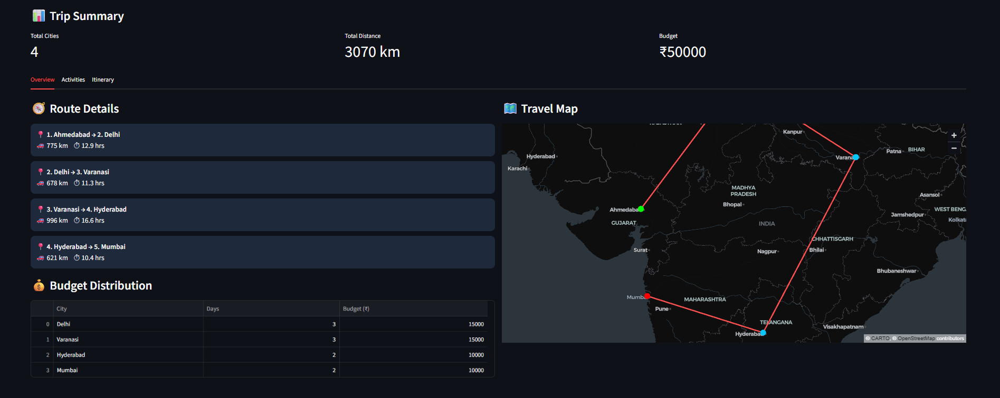

# 🌍 AI Travel Planner

An AI-powered web app that helps users plan smart multi-city trips by generating routes, budgets, activities, and day-wise itineraries in seconds.

---

## 💡 Problem & Solution

Planning a multi-city trip is often confusing and time-consuming.

This app simplifies the process by:
- Automatically generating optimized travel routes  
- Suggesting activities for each destination  
- Distributing budget intelligently  
- Creating a complete itinerary in seconds  

---

## 🚀 Features

- 🌍 Multi-city trip planning (start → stops → destination)  
- 🗺️ Interactive travel route visualization on map  
- 💰 Smart budget distribution per city  
- 📊 Trip summary (total cities, distance, budget)  
- 📅 Day-wise itinerary generation  
- 🎯 AI-based recommendations using ML model  
- 📍 30+ curated destinations (India + International)  
- ⚡ Clean, responsive Streamlit UI  

---

## ⚙️ How It Works

1. User enters starting city, stops, destination, budget, and days  
2. The app processes destination dataset and user inputs  
3. Distance and travel time are calculated between cities  
4. ML model helps personalize travel recommendations  
5. The app generates:
   - 🧭 Route details  
   - 🗺️ Travel map visualization  
   - 💰 Budget distribution  
   - ✨ Suggested activities  
   - 📅 Day-wise itinerary  

---

## 🛠 Tech Stack

- Python  
- Streamlit (Frontend + UI)  
- Scikit-learn (ML model)  
- Pandas (Data handling)  
- PyDeck (Map visualization)  

---

## 📸 Screenshots

### 📊 Trip Overview & Route Map


### ✨ Suggested Activities


### 📅 Day-wise Itinerary


---

## ▶️ Run Locally

```bash
pip install -r requirements.txt
streamlit run app.py
```
---
## 🌐 Live Demo
👉 Try the app here: [ai-travel-planner.streamlit.app/](https://ai-travel-planner1.streamlit.app/)

⚠️ Note: The app may take a few seconds to load initially as it is hosted on free Streamlit Cloud.
